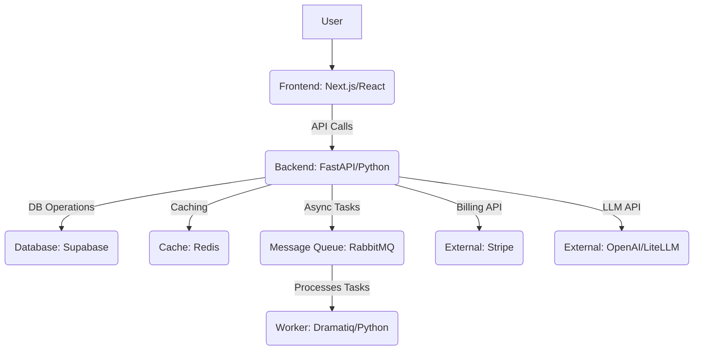

# Architectural Analysis

This document provides a detailed analysis of the project's key components, technologies, and dependencies, along with an overview of the overall architecture.

## 1. Backend Analysis

*   **Technology Stack:** The backend is built with Python, utilizing the FastAPI framework for API development, Uvicorn as the ASGI server, and Gunicorn as the WSGI HTTP server for production deployment.
*   **Dependencies:** Key dependencies include `redis` for caching/data storage, `supabase` for database interactions and authentication, `litellm` and `openai` for Large Language Model (LLM) integrations, `stripe` for billing functionalities, and `langfuse` for observability and tracing. `dramatiq` is used for background task processing, which communicates via `rabbitmq`.
*   **Containerization:** The `backend/Dockerfile` uses `python:3.11-slim` as its base image. It installs system dependencies, creates a non-root user (`appuser`), installs Python packages from `requirements.txt` (including `gunicorn`), and exposes port 8000. The application is run using Gunicorn, configured for optimal performance with specific worker and thread counts.

## 2. Frontend Analysis

*   **Technology Stack:** The frontend is a Next.js application, leveraging React for UI development, TypeScript for type safety, and Tailwind CSS for styling.
*   **Dependencies:** It uses `@radix-ui` for a robust set of UI components, `@supabase/ssr` and `@supabase/supabase-js` for seamless integration with Supabase, and `@tanstack/react-query` for efficient data fetching and state management. `framer-motion` is included for animations, `react-pdf` for PDF rendering, and `marked` for markdown parsing.
*   **Containerization:** The `frontend/Dockerfile` is based on `node:20-slim`. It installs necessary build dependencies (e.g., `python3`, `make`, `g++`, `libcairo2-dev`) required for `node-gyp` (likely for `canvas` used by `react-pdf`), installs npm dependencies, builds the Next.js application, and exposes port 3000. The default command is `npm start`.
*   **Next.js Configuration:** `frontend/next.config.ts` includes Webpack configurations to handle `canvas` as an external dependency and sets `canvas: false` in `config.resolve.fallback`. This is a common pattern to prevent issues with client-side rendering of PDF files, especially when using libraries like `pdf.js`.

## 3. Database/Service Analysis

*   **`docker-compose.yaml`:** This file orchestrates the multi-service application environment. It defines:
    *   `redis`: A Redis 7-alpine instance for caching and potentially other data storage needs, exposed on port 6379.
    *   `rabbitmq`: A RabbitMQ instance for message queuing, exposed on ports 5672 and 15672 (management UI).
    *   `backend`: The main FastAPI application, built from the `backend/` directory, exposed on port 8000. It depends on `redis` and `rabbitmq`.
    *   `worker`: A separate service also built from the `backend/` directory, running Dramatiq for background task processing. It also depends on `redis` and `rabbitmq`.
    *   `frontend`: The Next.js application, built from the `frontend/` directory, exposed on port 3000. It depends on the `backend` service.
*   **Supabase Integration:** The `backend/supabase/` directory contains configurations for a local Supabase setup.
    *   `config.toml`: Details the local Supabase services, including the API (port 54321), database (port 54322), Supabase Studio (port 54323), and Inbucket (email testing server, port 54324). It also configures authentication, storage buckets (specifically `agentpress` for file storage), and edge functions.
    *   `.env.example`: Defines environment variables primarily for Stripe integration, including `STRIPE_API_KEY`, `STRIPE_WEBHOOK_SIGNING_SECRET`, and `ALLOWED_HOST` for billing portal redirects. This confirms that the application incorporates a billing system.

## 4. Overall Architecture

The application employs a containerized, microservices-oriented architecture, orchestrated by Docker Compose.

*   **User Interface:** The `Frontend` (Next.js/React) provides the web-based user interface.
*   **Core Logic:** The `Backend` (FastAPI/Python) serves as the main API layer, handling requests from the frontend. It integrates with various services for its core functionalities.
*   **Data Persistence & Auth:** `Supabase` acts as the primary database and handles user authentication.
*   **Caching:** `Redis` is used for caching and potentially other fast data access needs.
*   **Asynchronous Processing:** `RabbitMQ` facilitates asynchronous communication, enabling the `Backend` to offload long-running tasks to the `Worker` service (Dramatiq).
*   **External Integrations:** The `Backend` directly integrates with `Stripe` for billing and `LLM Providers` (OpenAI, LiteLLM) for AI-driven features.